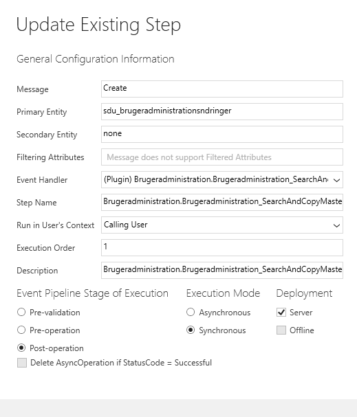

# SearchAndCopyMasterRights
## Formål
Koden har til hensigt at fremsøge, kopiere og oprette de godkendte rettigheder indenfor bestemte rettighedsområder.
Dette vil synliggøre de aktuelle rettigheder for sekretæren/brugeren i CRM, uden at de behøver tage stilling til *master* rettighederne (altså de godkendte rettigheder).

## Funktionalitet
Koden kaldes som et plugin: *Create, sdu_brugeradministrationsndring, Post-operation, Synchronous*. 

Se billede:

Der anvendes to metoder:
1. QueryForApprovedRights
2. CreateCopiesOfApprovedRights

### QueryForAprrovedRights
Denne metode anvendes til fremsøge de records, hvori der ligger en godkendelse af nogle rettighederne. Recorden skal have **godkendt** i feltet *bestillingsstatus*.
Recordsne fundes ved at kigge på de records som er relateret til den samme brugeradministration, som selve rettighedsbestillingen også er (for at sikre, at man finder rettighederne på den rigtige person).
Resultaterne herfra returneres som en **EntityCollection**.

### CreateCopiesOfApprovedRights
Denne metode kaldes med ovenstående EntityCollections return som parameter (blandt andet). Den kaldes kun hvis der eksisterer nogle master records.
Metoden opretter nye records, som er "bestillinger". De er 100% identiske med master recordsne. Så selvom en bruger har oprettet 100 ansøgninger, og ændret i de enkelte bestillinger for hver ansøgning - så vil rettighederne altid afspejle masteren, når der oprettes en ny ansøgning.

Det er defineret i koden hvilke felter man ønsker at kopiere fra master -> bestilling. Dette gøres i en **List** af **Tuple<string,string>**. Item1 er datatypen, mens item2 er det logiske navn på værdien.
Der anvendes derudover et **InitializeFromRequest** for at sikre at bestillingen korrekt arver de mapninger, som er defineret i relationen i CRM.

## Fleksibilitet og fremtidige ændringer
I princippet kan metoderne anvendes på hvilken entitet det skal være, såfremt der er tale om elementer der har *brugeradministrationen* som fælles bindeled. For hvert område defineres entitet der søges i, og hvilke felter der kopieres. Det er bevidst blevet fravalgt at tage ALLE felter fra master -> bestilling, da det ikke altid er ønskværdigt at få det hele med.

Metoden CreateCopiesOfApprovedRights kan pt. kun håndtere datatyperne **bool** og **EntityReference**.

## Changelog 
07-01-2020: Log oprettet. Solution: **ASS_OessHrQlikview**